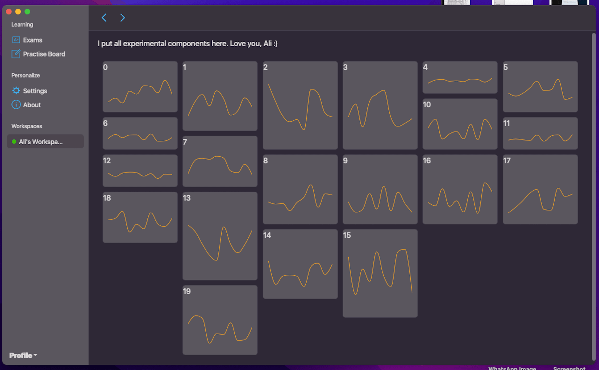
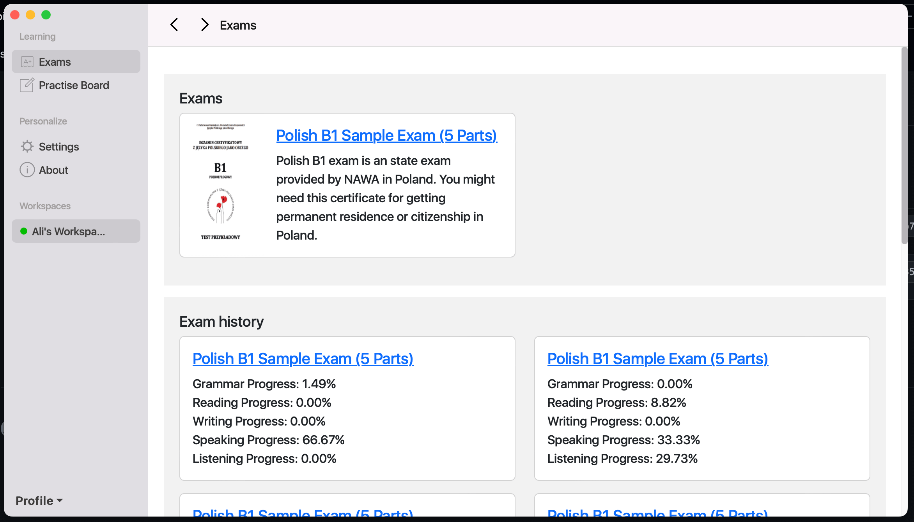
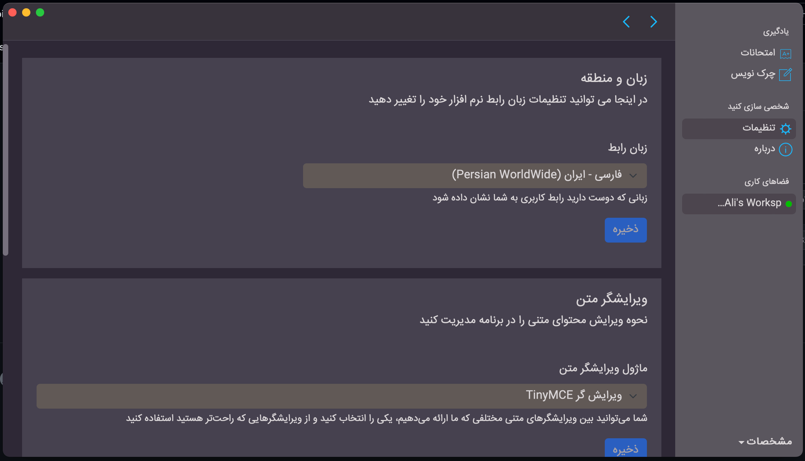
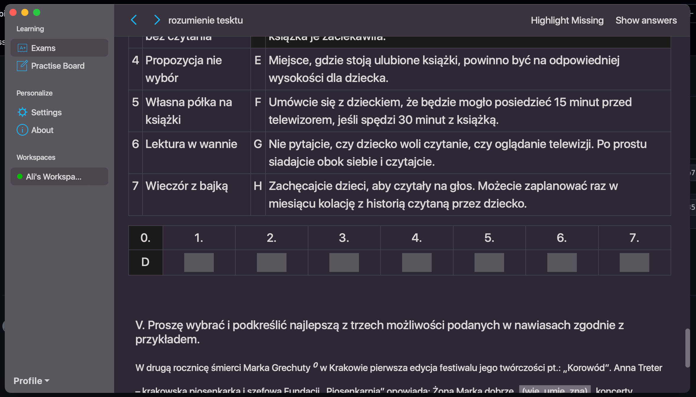

# React go dashboard

Web, Desktop, Embedded and Mobile apps done right, once, and never do rewrite.

## [Demo with mock data](https://torabian.github.io/react-go-dashboard)

There is a github hosted version of the front-end, which runs in the browser only. The backend of this project,
generates mock data for front-end, so it could be used for such purposes. Features _do not work_, it's only presentation layer.

## Motivation

After building a decade of the repeatitive UI's for front-end project, i've put all the experience into building
a boilerplate which is not limited to start of a project, rather would scale up to enterprise level.

- It's based on react, react-query, no redux or any extra libraries
- Autogenerated http calls from backend in front-end, front-end does not write any http code
- It has MacOSX dark/light theme by default, and can support many more themese (Windows/Ubuntu are in milestone)
- Backend is fully written in golang, provides HTTP, CLI, GRPC support
- Database could be SQLite, or MySQL. It's fully normalized, and indexed table.
- Advanced code generation. It converts yaml definitions into golang/react code.
- Keyboard functionality
- Real translation of everything, server error messages, numbers, date and times.
- Unified http request, providing query-dsl a like system, full pagintion, sort, for every entity
- Self installing products. Any project on top of this comes with Installers on Windows Server, Ubuntu, and Mac package by default.
- Super lightweight front-end. A mid size app would weight 800KB on the disk, and 300KB is transferred on some pages,
  enough to be flashed into microcontrollers with 2MB storage.
- Backend section can be compiled into Android and IOS binaries, and there is a cordova plugin which runs the front-end as mobile app. In fact, due to low wieght of the front-end, it works quite performant in comparison with UI frameworks.

For any questions, or possible projects, contact me. I usually answer in 24 hours.

ali-torabian@outlook.com
